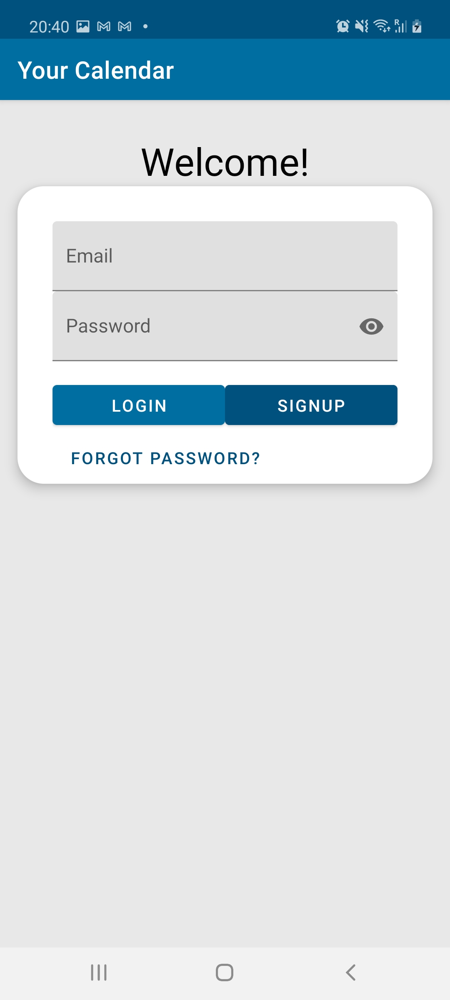
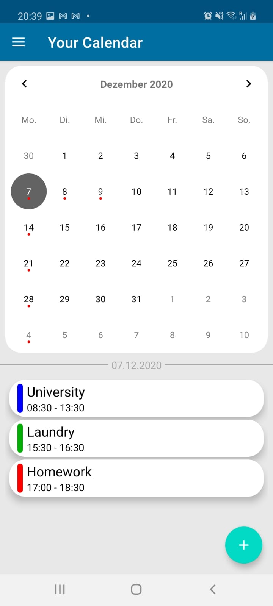
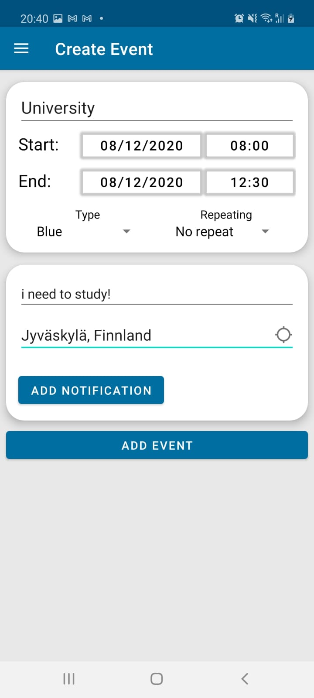
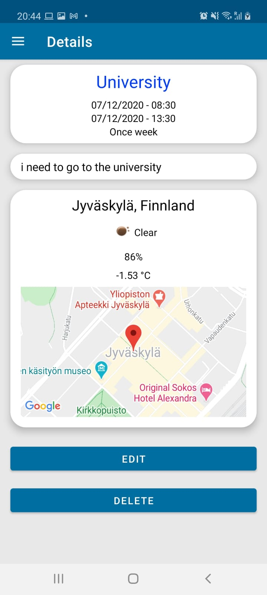
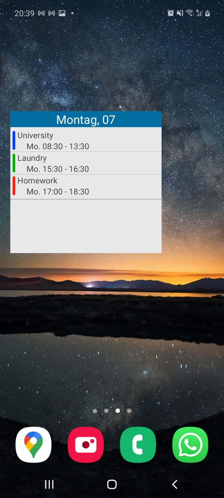

# Mobile-project - Your Calendar

* Course: TTOW0635 Mobile Project
* Team: Daniel Smolen & Joel Aalto

A Calender app, which shows all your meetings, the location of the meeting and the weather in the planned time window.

## Material

* [Course page](http://mobile.pages.labranet.jamk.fi/mobile-project/)
* [Project wiki](https://gitlab.labranet.jamk.fi/AA4915/your-calendar/-/wikis/home)
* [Work hours](https://gitlab.labranet.jamk.fi/AA4915/your-calendar/-/wikis/work-hours)
* [Demo video](https://www.youtube.com/watch?v=H-jfpvaSby4&feature=youtu.be)
* [End report](https://gitlab.labranet.jamk.fi/AA4915/your-calendar/-/wikis/End-report)

## Screenshots

